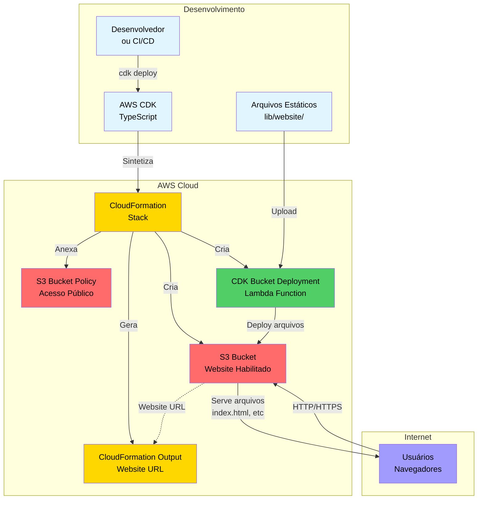

# Static Website with S3 CDK

Projeto AWS CDK (Cloud Development Kit) em TypeScript para deploy automático de sites estáticos no Amazon S3, configurado como website hospedado.

## 📋 Sobre o Projeto

Este projeto utiliza o AWS CDK para criar e configurar automaticamente uma infraestrutura na AWS para hospedar sites estáticos. A stack criada inclui:

- **Bucket S3** configurado como website estático
- **BucketDeployment** para fazer deploy automático dos arquivos
- **Política de acesso público** configurada para leitura
- **Remoção automática** de objetos ao deletar a stack
- **Output** com a URL do website criado

## ✨ Recursos

- ✅ Deploy automatizado de arquivos estáticos para S3
- ✅ Configuração automática do bucket como website
- ✅ Acesso público de leitura configurado
- ✅ Remoção automática de objetos ao destruir a stack
- ✅ Configuração flexível via props
- ✅ Testes unitários com Jest
- ✅ CI/CD com GitHub Actions

## 🛠️ Tecnologias

- **AWS CDK** v2.232.1
- **TypeScript** ~5.9.3
- **Jest** para testes
- **Node.js** 18+

## 📦 Pré-requisitos

Antes de começar, certifique-se de ter instalado:

- [Node.js](https://nodejs.org/) (versão 18 ou superior)
- [npm](https://www.npmjs.com/) ou [yarn](https://yarnpkg.com/)
- [AWS CLI](https://aws.amazon.com/cli/) configurado
- [AWS CDK CLI](https://docs.aws.amazon.com/cdk/latest/guide/cli.html)

```bash
npm install -g aws-cdk
```

## 🚀 Instalação

1. Clone o repositório:
```bash
git clone <url-do-repositorio>
cd static-website-with-s3-cdk
```

2. Instale as dependências:
```bash
npm install
```

3. Compile o código TypeScript:
```bash
npm run build
```

## 📁 Estrutura do Projeto

```
static-website-with-s3-cdk/
├── bin/
│   └── static-website-with-s3-cdk.ts    # Ponto de entrada da aplicação
├── lib/
│   ├── static-website-with-s3-cdk-stack.ts  # Definição da stack CDK
│   └── website/                             # Arquivos do site estático
│       ├── index.html
│       └── page1/
├── test/
│   └── static-website-with-s3-cdk.test.ts   # Testes unitários
├── cdk.json                                  # Configuração do CDK
├── tsconfig.json                             # Configuração do TypeScript
├── jest.config.js                            # Configuração do Jest
└── package.json                              # Dependências do projeto
```

## 🎯 Uso

### Deploy Básico

Para fazer deploy da stack com configurações padrão:

```bash
# Verificar o template CloudFormation gerado
npx cdk synth

# Visualizar diferenças antes do deploy
npx cdk diff

# Fazer deploy da stack
npx cdk deploy

# Deletar a stack
npx cdk destroy
```

### Configuração Personalizada

Você pode personalizar a stack editando o arquivo `bin/static-website-with-s3-cdk.ts`:

```typescript
new StaticWebsiteWithS3CdkStack(app, 'StaticWebsiteWithS3CdkStack', {
  bucketName: 'meu-site-personalizado',
  websiteIndexDocument: 'home.html',
  websiteDirectory: './meu-site',
  exportName: 'url-do-meu-site',
  // Configurar região específica
  env: { 
    account: '123456789012', 
    region: 'us-east-1' 
  },
});
```

### Valores Padrão

- **Bucket Name**: `static-website-with-cdk`
- **Index Document**: `index.html`
- **Website Directory**: `./website` (relativo ao diretório `lib/`)
- **Export Name**: `static-website-with-s3-url`

## 🧪 Testes

Execute os testes unitários:

```bash
npm test
```

Os testes verificam:
- ✅ Criação do bucket S3 com configuração de website
- ✅ Configuração de acesso público
- ✅ Política de bucket para leitura pública
- ✅ BucketDeployment para deploy de arquivos
- ✅ Output com URL do website

## 📝 Comandos Úteis

```bash
# Executar testes
npm test

# Sintetizar template CloudFormation
npx cdk synth

# Comparar stack deployada com o código atual
npx cdk diff

# Fazer deploy da stack
npx cdk deploy

# Destruir a stack
npx cdk destroy
```

## 🏗️ Arquitetura

A stack cria os seguintes recursos AWS:

1. **S3 Bucket**: Bucket configurado para hospedar website estático
   - Website habilitado com documento índice
   - Acesso público de leitura configurado
   - Auto-delete de objetos habilitado
   - Política de remoção: DESTROY

2. **S3 Bucket Policy**: Política que permite acesso público de leitura

3. **CDK Bucket Deployment**: Recurso customizado que faz o deploy dos arquivos do diretório `website/` para o bucket

4. **CloudFormation Output**: URL do website gerada automaticamente

### Diagrama de Arquitetura



## 🔄 CI/CD

O projeto inclui um workflow do GitHub Actions (`.github/workflows/deploy.yaml`) que:
- Faz deploy automático quando um PR é mergeado na branch `main`
- Utiliza OIDC para autenticação com AWS (sem necessidade de credenciais)
- Requer os seguintes secrets configurados no GitHub:
  - `AWS_OIDC_ROLE`: ARN da role IAM para OIDC
  - `AWS_REGION`: Região AWS para deploy

## 🔐 Segurança

**⚠️ Importante**: Este projeto configura acesso público ao bucket S3 para leitura. Certifique-se de que:
- Os arquivos no diretório `website/` não contenham informações sensíveis
- Você está ciente dos custos de transferência de dados do S3
- Você possui as permissões adequadas na AWS

## 📚 Recursos Adicionais

- [Documentação AWS CDK](https://docs.aws.amazon.com/cdk/)
- [Documentação S3 Website Hosting](https://docs.aws.amazon.com/AmazonS3/latest/userguide/WebsiteHosting.html)
- [AWS CDK TypeScript API Reference](https://docs.aws.amazon.com/cdk/api/v2/docs/aws-construct-library.html)

## 🤝 Contribuindo

Contribuições são bem-vindas! Sinta-se à vontade para:
1. Fazer fork do projeto
2. Criar uma branch para sua feature (`git checkout -b feature/AmazingFeature`)
3. Commit suas mudanças (`git commit -m 'Add some AmazingFeature'`)
4. Push para a branch (`git push origin feature/AmazingFeature`)
5. Abrir um Pull Request

## 📄 Licença

Este projeto está licenciado sob a licença MIT - veja o arquivo [LICENSE.txt](LICENSE.txt) para detalhes.

## 👤 Autor

**Marcio Cruz de Almeida**

---

⭐ Se este projeto foi útil para você, considere dar uma estrela!
